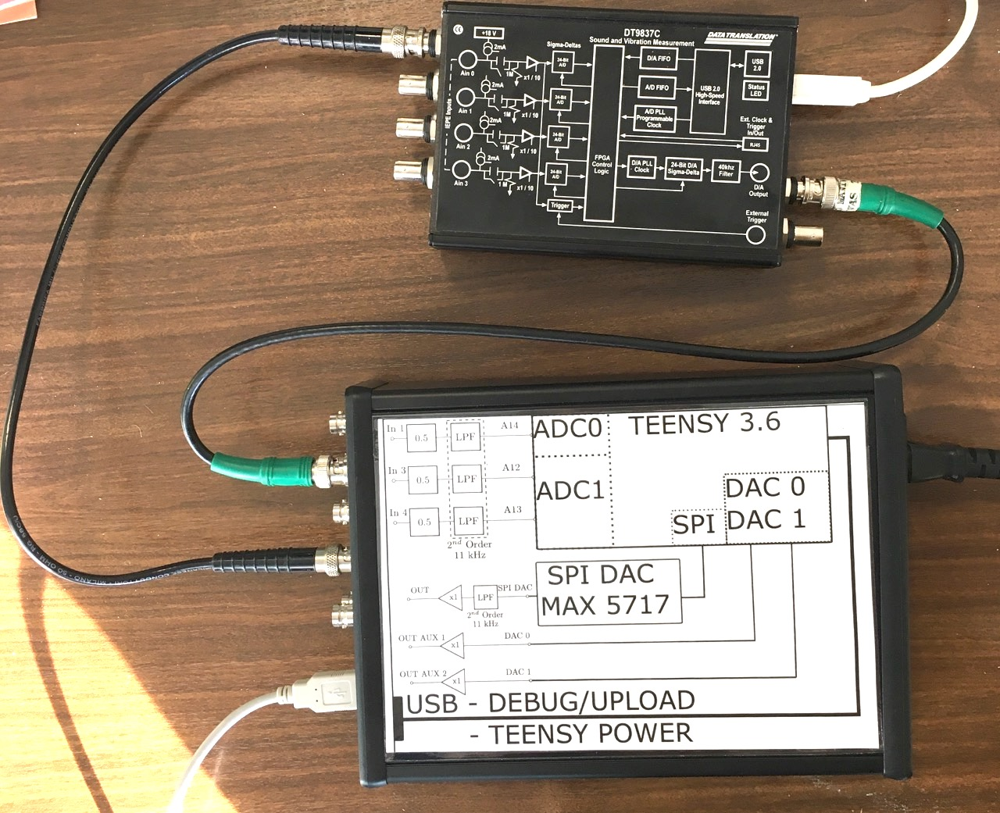

## Talkthrough example

Connect DataTranslation DT9837
- DT/Output -> Teensy/IN1
- Teensy/OUT -> DT/Ain0

Arduino IDE
- open teensy_01_talkthrough/teensy_01_talkthrough.ino in Arduino IDE
- compile and load

Run measurement_DT9837.py from python 3.19.12 (anaconda)
- it should show the signal passed through

## Filter example

Run filter_design.py to change the filter
- note: fs must be the same as for teensy (teensy_02_filter.ino) !!!
- filter_design.py prints the filter coefficients in the c++ format (just copy paste)

Arduino IDE
- open teensy_02_filter/teensy_02_filter.ino in Arduino IDE
- copy paste filter coefficients
- compile and load

Run measurement_DT9837.py from python 3.19.12 (anaconda)
- it should show the signal passed through
- change the excitation frequency to see the output filtered

